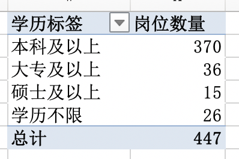

# excel-data-analysis

对拉勾网数据分析师岗位做数据分析

## 数据分析思路

数据分析主要有三个阶段，数据采集，数据清洗，数据可视化。

## 数据采集

岗位数据来自于拉勾网，采用“后羿采集器”进行数据采集，数据导出为Excel格式

## 数据的清洗与处理

### 1. 数据清洗

1）处理“工作经验”这列的数据

使用excel的替换功能，将“工作经验”这列中含有的“经验”去掉。

2）处理“岗位描述”这列数据

找出数据缺省值，利用“=LEN(K2)<15”判断表格内容是否小于15字符，并筛选出结果为“TRUE”，删除对应的行数据。

3）处理薪资 

从“薪资区间”数据，采集薪资上下限

薪资上限：=LEFT(RIGHT(C2,LEN(C2)-FIND("-",C2)),LEN(RIGHT(C2,LEN(C2)-FIND("-",C2)))-1)

薪资下限：=LEFT(C2,SEARCH("k",C2)-1)

### 2. 数据处理

1）企业所属行业分析

利用Excel的数据透视表，对企业所属的行业进行统计。
由图可知，招聘数据分析师岗位的企业，大多数是属于移动互联网行业，其次是金融和电商行业。

2）岗位分析

利用[wordcloud词云工具](词云生成程序.py)，对“职位诱惑”和“职位描述”进行词云统计，输出词云图片

（1）职位诱惑

（2）职位关键词描述

（3）学历要求

通过柱形图可以看出，基本所有的公司都要求数据分析师的学历在本科以上。

（4）工作经验 

利用Excel数据透视表，将工作经验的数据进行数据统计，并利用柱形图进行数据展示。通过柱形图可以看出，数据分析师的工作经验要求都集中在1-3年和3-5年。 

3）薪资分析

（1）薪资分析

从图可看出，数据分析师岗位的薪资大多集中在5k-20k之间。

## 数据分析总结

1. 数据分析师岗位，主要是移动互联网行业的公司。 

2. 技能要求：SPSS，SQL，BI，数据仓库等，以及算法和可视化工具使用能力。

3. 学历要求：本科及以上学历。 

4. 薪资：一年工作经验以上的薪资相对较高，并且薪资集中在5k-20k之间

